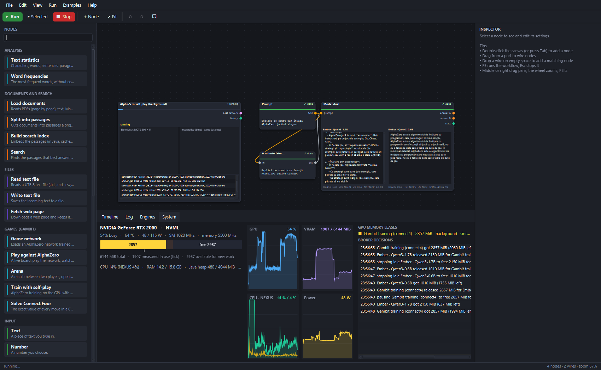
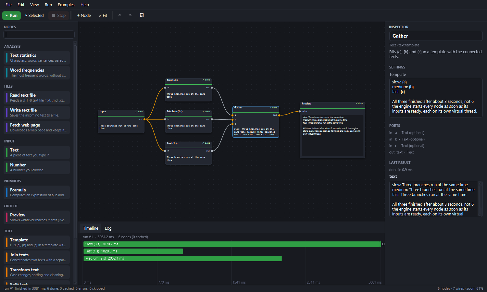
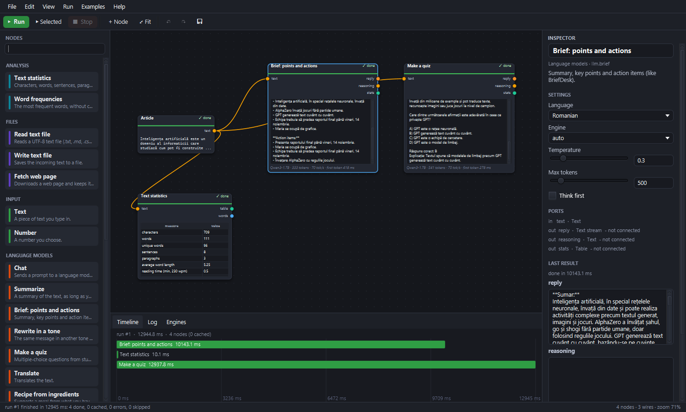
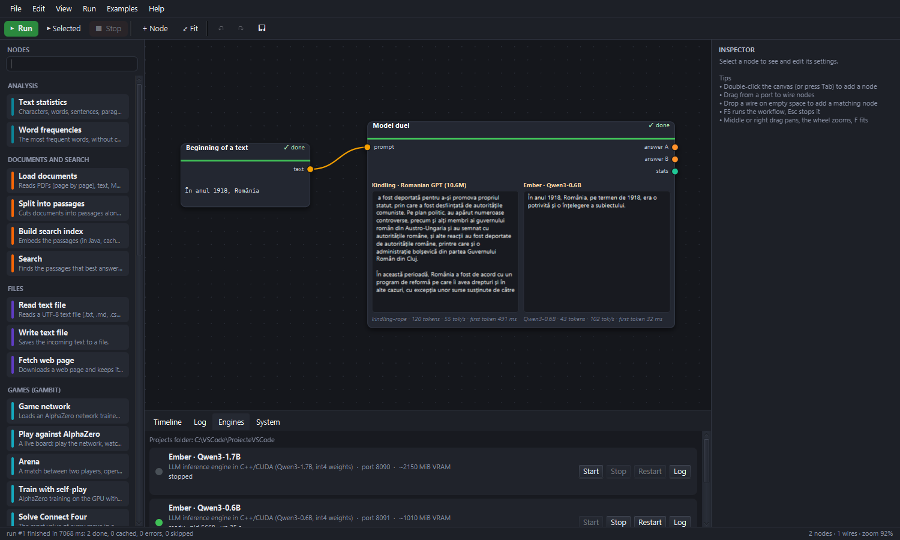
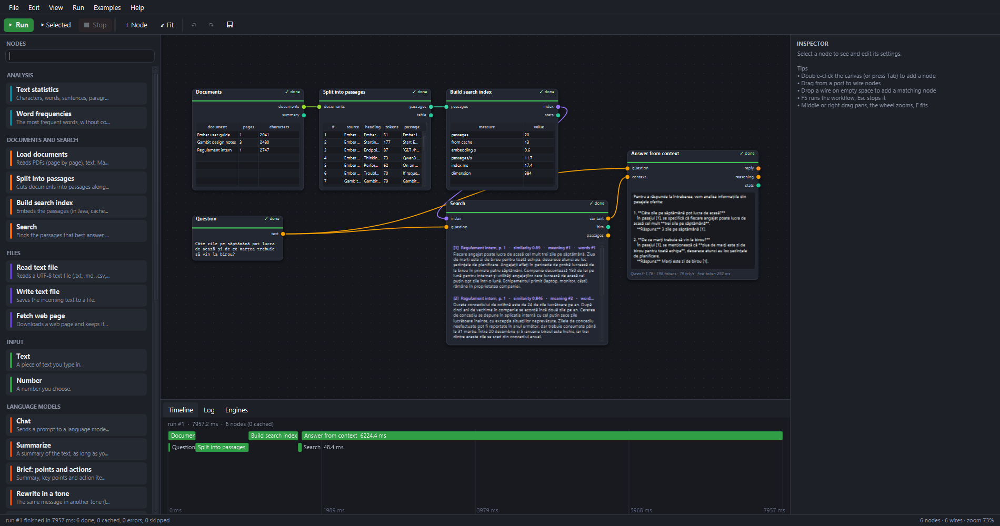
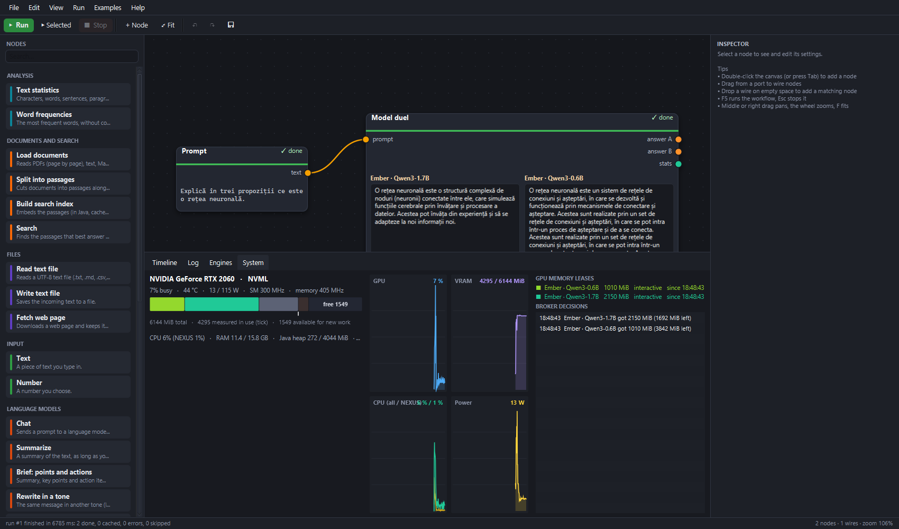
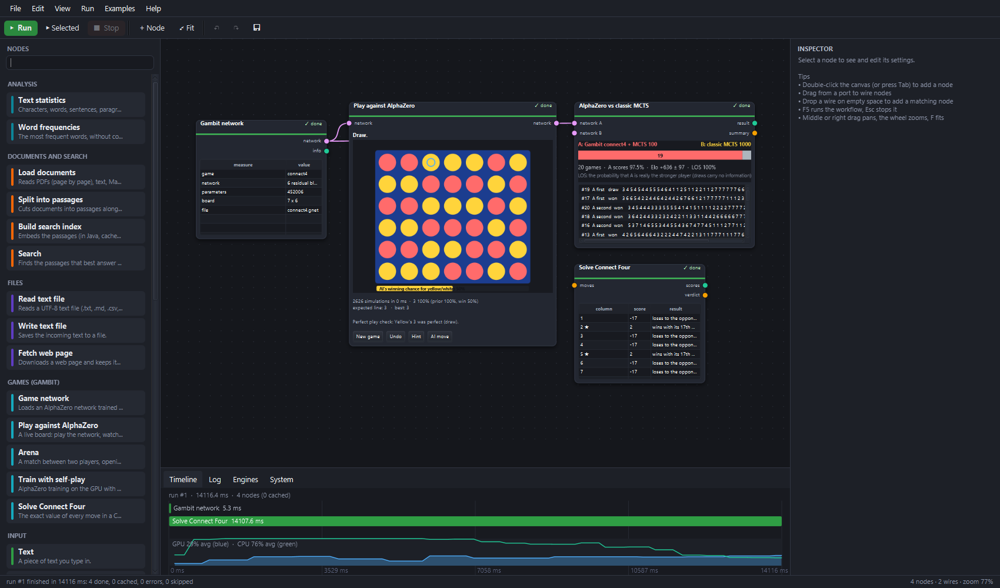
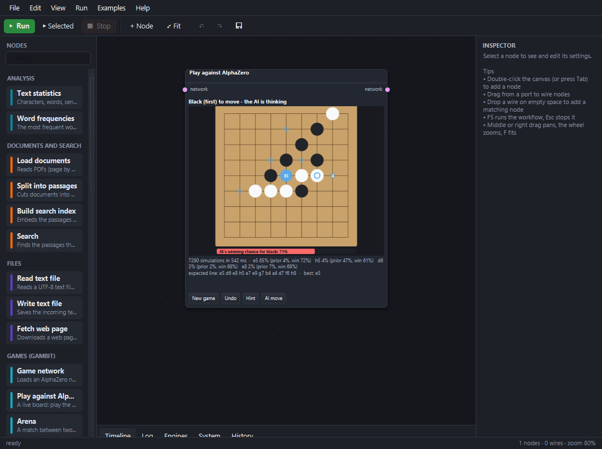
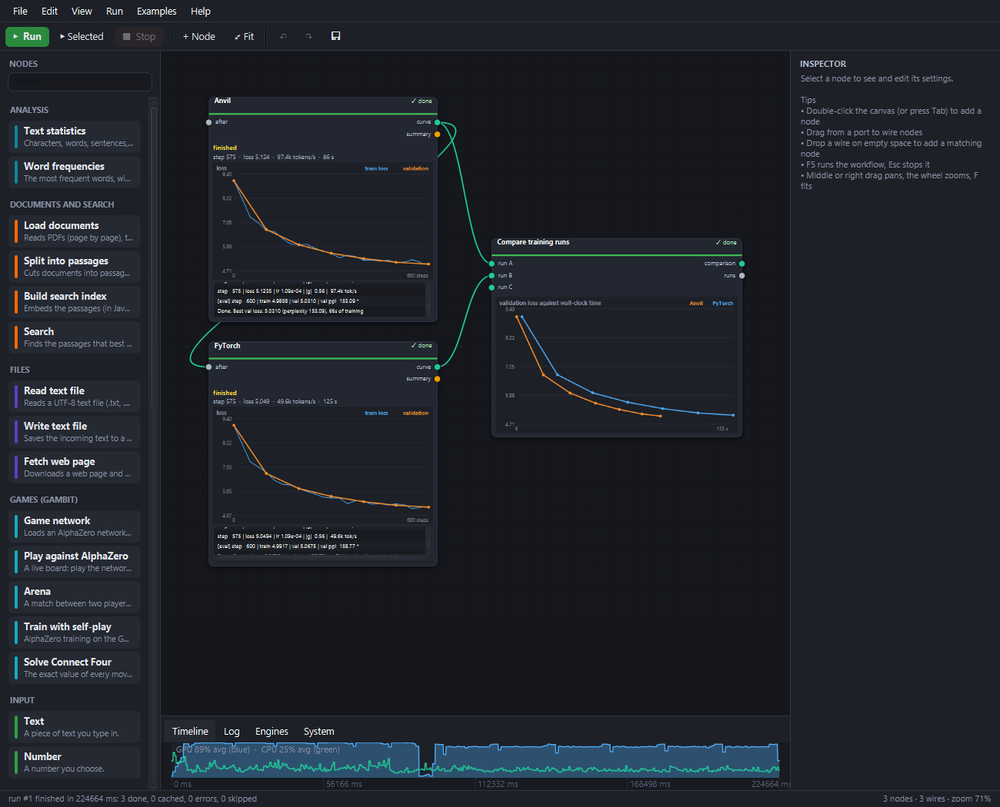
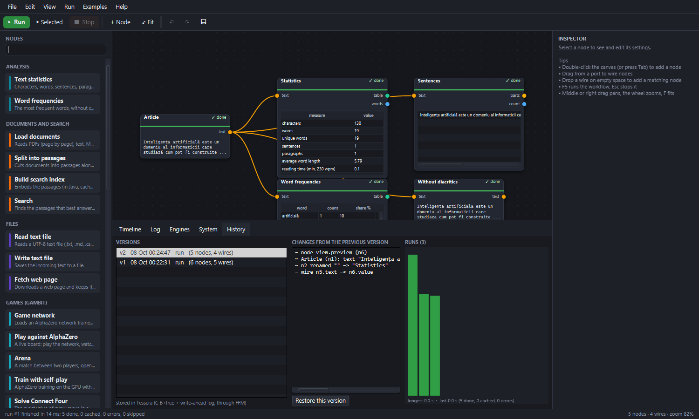

# NEXUS

**A visual AI studio in Java.** You build workflows by wiring nodes on a canvas with the mouse, and they run live:
- text streams into nodes as a model writes it;
- an AlphaZero network thinks on a board you can play on;
- a GPU dashboard shows who holds the card's memory.

NEXUS ties together the AI projects I built before. Each one plugs in as an engine:

| project | what it is | how NEXUS uses it |
|---|---|---|
| [Ember](https://github.com/YUStulinu/Ember) | LLM inference engine in C++/CUDA (Qwen3) | supervised server process; streaming chat nodes, recipes, model duels |
| [Kindling](https://github.com/YUStulinu/Kindling) | a 14M-parameter GPT trained from scratch on Romanian | an OpenAI-compatible server written for NEXUS; duels; training runs |
| [Anvil](https://github.com/YUStulinu/Anvil) | a deep-learning framework from scratch (CuPy + own CUDA kernels) | GPT training node, raced against PyTorch |
| [Gambit](https://github.com/YUStulinu/Gambit) | AlphaZero in C# | its networks run **in Java** (Vector API); live board, arena, perfect solver; self-play training |
| [Tessera](https://github.com/YUStulinu/Tessera) | crash-safe B+tree key-value store in C | workflow versions and run history, called through the **Foreign Function & Memory API** |
| VectorialSearch / SecondBrain (ideas) | semantic search, notes | a retrieval pipeline written in Java: BERT encoder, HNSW, BM25, PDF ingestion |

NEXUS is about 17,000 lines of Java 25 in six modules: JavaFX, Vector API, FFM API, virtual threads and JPMS.



*AlphaZero self-play trains in the background (left) while two Ember models answer the same prompt (right). The GPU memory broker (bottom right) recorded each step:*
1. *It paused the training to make room for the second model.*
2. *Once the models had been idle for a minute, it stopped them.*
3. *It resumed the training.*

---

## Contents

1. [What it can do](#1-what-it-can-do)
2. [Measurements](#2-measurements)
3. [How it works](#3-how-it-works)
4. [Running it](#4-running-it)
5. [Project layout](#5-project-layout)
6. [Tests and CI](#6-tests-and-ci)
7. [Publishing to GitHub](#7-publishing-to-github)

---

## 1. What it can do

### A node editor with a concurrent, incremental execution engine

- **The canvas:**
  - zoomable, with typed ports; incompatible wires are refused;
  - a palette, an inspector and quick-add (Tab, or drop a wire on empty space);
  - undo/redo;
  - workflows are saved as JSON files.
- **Execution:** dataflow on virtual threads. Independent branches run in parallel, and a node starts as soon as its own inputs are ready. Text *streams* through wires, so a downstream node can show an answer while the model is still writing it.
- **Incremental runs:** results are cached by a SHA-256 fingerprint of each node's type, its parameters, its upstream fingerprints and the contents of the files it reads. A second run recomputes only what changed.
- **Timeline:** a profiler-like view of every run, with nodes packed into lanes so parallelism shows at a glance. Under the bars, GPU and CPU load are sampled every 100 ms during the run.



### Language models (Ember, Kindling)

- **Engines are supervised child processes:**
  - started on demand; if a healthy server already answers on the port, NEXUS attaches to it;
  - health-polled;
  - restarted after a crash with exponential backoff (2/4/8 s, at most 3 times in 5 minutes);
  - killed when NEXUS exits.
- **Streaming:** OpenAI-compatible SSE streaming, including Qwen3's separate reasoning channel and token usage.
- **Nodes:**
  - **Chat**, plus recipe nodes: *Summarize, Brief (points and action items), Rewrite in a tone, Make a quiz, Translate, Recipe from ingredients*. These are local versions of my earlier small apps.
  - **Answer from context**, with `[n]` citations.
  - **Model duel**: one prompt, two models side by side, with their speed.
  - **Conversation**: a chat inside a node.
- **Kindling** gets an OpenAI-compatible server written for NEXUS ([engines/kindling](engines/kindling/kindling_server.py)), so the small Romanian GPT can duel Qwen3. Kindling continues text and does not follow instructions, and NEXUS shows that honestly.

| Brief and quiz, in parallel | Kindling (10.6M) vs Qwen3-0.6B |
|---|---|
|  |  |

### Ask your documents: retrieval written in Java

The whole pipeline runs in the JVM. Python and native ML libraries play no part.

- **Encoder:** multilingual-e5-small (a 12-layer BERT) computed with the **Vector API**:
  - weights memory-mapped from `safetensors` through the FFM API;
  - its SentencePiece-Unigram tokenizer re-implemented, including the precompiled normalization charmap.
  - Checked against Hugging Face `transformers`: identical tokens on tricky inputs, embeddings with cosine > 0.99999.
- **Indexes:**
  - **HNSW** vector index;
  - **BM25** with folded diacritics and light Romanian/English stemming (Romanian attaches the article to the noun, so "bufferul" must match "buffer");
  - the two fused with **reciprocal rank fusion**, where the keyword vote is weighted by how rare the matched words are.
- **Documents:**
  - **PDF** ingestion page by page (PDFBox), with page numbers kept for citations; also Markdown, text and HTML;
  - **structure-aware chunking**: passages never cross a heading, overlap by a sentence, and carry their title and heading into the embedding;
  - an **embedding cache** on disk: re-indexing a folder embeds only what changed.



### The GPU memory broker and the system dashboard

A 6 GB card cannot hold two LLMs and a training run at once. Without coordination, the last process to allocate dies with a CUDA out-of-memory error. In NEXUS, every GPU process first takes a **lease** of its memory budget from the broker.

**Available memory** = total − safety margin − every lease − what other programs really use (measured):
- leases count even while their process is still loading;
- memory used by the desktop, the browser and games is measured, so it is respected too.

**When a request does not fit, the broker makes room, cheapest option first:**
1. It **stops idle LLM servers**, least recently used first; the next request restarts them.
2. It **pauses background training**, but only for interactive work. The trainer stops, returns its memory, and resumes from its last checkpoint once memory is free again.

Engines that are in the middle of an answer are never evicted. Requests wait in a priority queue, so background work cannot starve interactive work.

**GPU monitoring:** NVML is called directly through the **FFM API**, with no JNI and no helper process, and falls back to `nvidia-smi`. The **System** tab shows:
- the card's memory split by holder;
- five minutes of GPU, VRAM, CPU and power history;
- the leases, the waiting requests and every broker decision.



### AlphaZero (Gambit) in Java

Gambit's `.gnet` networks (a 6×64 residual network with policy and value heads) run in Java on the **Vector API**. Their outputs match Gambit's C# engine, and so does the search: Gambit's PUCT MCTS (first-play urgency, virtual loss, tree reuse) is ported with the same constants and tie-breaking, so **the visit counts after 400 simulations are identical** to Gambit's.

- **Play against AlphaZero:** a live board. While the AI thinks, every move shows the share of the search it receives. Below the board you see the AI's winning chances, its expected line, and the network's prior next to the search result. Watching how the search overrules the prior is the most instructive part.
- **Perfect-play check:** Connect Four is solved, and NEXUS includes Gambit's solver ported to Java (negamax, alpha-beta, transposition table, bitboards). It grades every move: *"Yellow's 3 was a mistake: it loses to the opponent's 4th move; column 5 draws."*
- **Arena:**
  - matches on random openings, each played twice with colours swapped;
  - score, Elo difference with its 95% margin, and likelihood of superiority;
  - opponents: another network, classic MCTS with random playouts, random moves, or the perfect solver.
- **Self-play training** with Gambit's own trainer (TorchSharp/CUDA), as a pausable background job under the broker. Each generation's Elo and losses appear live, and each generation's network can be loaded at once.

| Connect Four: arena, solver, AI vs AI | Gomoku: the search overruling the network |
|---|---|
|  |  |

In the Gomoku screenshot, the network's favourite move is h5 (prior 47%), but the search spends 85% of its 7,290 simulations on e5, which the network rated at 4%: looking ahead, the search found the threat that the network's first impression missed.

### Training language models: Anvil vs PyTorch

Kindling's GPT can be trained with **Anvil** (my framework: CuPy, FlashAttention, fused kernels) or **PyTorch** (Kindling's original script), with live loss curves. A comparison node puts runs on the same wall-clock axes. PyTorch saves checkpoints, so the broker may pause and resume it. Anvil cannot resume a run, so its memory is never taken back.



### History, kept in Tessera

Every version of a workflow that is run or saved is stored in **Tessera**, my C storage engine (B+tree, write-ahead log, crash recovery). NEXUS calls `tessera.dll` / `libtessera.so` directly through the FFM API. Moving nodes does not create a version. The **History** tab shows what changed between versions (nodes, parameters, wires), can restore any of them, and charts past runs. Without the native library, NEXUS falls back to a plain append-only file.



---

## 2. Measurements

All measurements were taken on one laptop: RTX 2060 (6 GB), 16 hardware threads, Windows 11, JDK 25.

**Language models through NEXUS**

| | |
|---|---|
| Qwen3-1.7B (Ember, int4) | 70–87 tokens/s streamed into a node |
| Qwen3-0.6B (Ember, int4) | 102–121 tokens/s |
| Kindling (10.6M, PyTorch) | 55 tokens/s |
| two recipe nodes on one Ember server | run concurrently |
| "Parallel branches" example (two 3 s delays + work) | 3.08 s instead of 6 s |

**Retrieval in Java** (multilingual-e5-small, 118M parameters)

| | |
|---|---|
| matrix multiply kernel, one thread | 53.5 GFLOPS |
| passage embedding, all cores | 20.7 passages/s of 295 tokens (6,100 tokens/s) |
| query embedding | 19.5 ms |
| agreement with Hugging Face `transformers` | identical tokens; cosine > 0.99999 |
| HNSW recall@10, 5,000 clustered vectors | 0.98 |
| Romanian questions over Romanian + English documents (incl. a PDF) | right passage first in 5 of 6, third in 1 |
| re-indexing an unchanged folder | 0 passages embedded (disk cache) |

**AlphaZero in Java** (6×64 ResNet, 452k parameters)

| | Java (NEXUS) | C# (Gambit) |
|---|---:|---:|
| Connect Four positions/s, one thread | **913** | 780 |
| Connect Four positions/s, batched on all cores | 5,450 | 7,000 |
| MCTS simulations/s while playing (batches of 16) | 5,670 (Gomoku 2,850) | 1,400–2,400 in the app |
| logits vs Gambit | within 2·10⁻⁴ | |
| visit counts after 400 simulations, 12 positions | identical | |
| perfect solver vs Gambit's 1,000 solved positions | all 7,000 move scores equal | |

| arena (20 games, random openings) | result |
|---|---|
| network alone (1 simulation) vs random | +20 =0 −0 |
| network + MCTS 50 vs classic MCTS 200 | +19 =0 −1 |
| network + MCTS 100 vs classic MCTS 1000 | +19 =1 −0 (+636 ± 97 Elo) |

**GPU, storage, training**

| | |
|---|---|
| reading the GPU through NVML (FFM) | 4.8 ms per sample, vs 70.7 ms for `nvidia-smi` |
| Tessera `get` through FFM | 4.8 µs |
| Kindling GPT, 600 steps: Anvil | 97.4k tokens/s, val loss 5.031 |
| Kindling GPT, 600 steps: PyTorch | 49.6k tokens/s, val loss 5.068 |
| Gambit self-play VRAM (512 parallel games) | ~650 MiB measured |

---

## 3. How it works

```
 nexus-app      JavaFX: canvas, node views (streaming text, boards, charts), panels: timeline, log,
                engines, system, history
     │
 nexus-store    Tessera via FFM, workflow versions, run history
 nexus-games    Gambit in Java: rules, .gnet network (Vector API), MCTS, solver, arena, training jobs
 nexus-ml       e5 encoder (Vector API + FFM mmap), tokenizer, HNSW, BM25, documents, RAG nodes
 nexus-engines  process supervision, OpenAI streaming client, LLM nodes, GPU broker + NVML, GPT training
     │
 nexus-core     typed graph, commands (undo/redo), workflow files, execution engine, basic nodes
```

Node libraries are discovered with `ServiceLoader`, so a module adds nodes just by providing a `NodeLibrary`.

**The execution engine.**
- A run takes an immutable snapshot of the graph.
- Each output port becomes a `CompletableFuture`, and each node runs on a virtual thread once its inputs are ready.
- A `TextStream` output is published *before* the node finishes, so consumers can render it as it grows. Typed conversions (stream → text, number → text, ...) happen on the wire.
- Cancellation propagates, and nodes downstream of a failure are marked *skipped*.
- The fingerprint of a non-cacheable node (an LLM call, a delay) includes a salt, so it always runs again. Nodes that read files add a content key (path, size and modification time), so editing a file invalidates exactly the nodes that read it.

**The GPU broker.** In short:

```
available = total − margin − Σ leases − max(0, measured used − Σ leases already loaded)
```

Leases are granted head-of-queue only, with the queue ordered by priority and then by arrival. To make room, the broker asks holders to give their memory back: idle `EVICT` holders (LLM servers) first, by least recent use, then `PAUSE` holders (background training), and only for interactive requests. Holders release asynchronously. If one has not released after 30 seconds, it counts as having declined.

**Retrieval.** RRF score = Σ over the semantic list and the keyword list of `weight / (60 + rank)`. The semantic weight is 1. The keyword weight is the summed idf of the matched terms, relative to the idf of a term found in a single passage. Without that weight, a passage sharing only the product's name with the question (which appears in half the corpus) got the same vote as one matching a rare term.

**The encoder.** Attention runs per head as matrix products, with the 1/√d scale folded into Q and V transposed. The linear layers use a column-blocked GEMM with a 4×2 register tile of FMAs; GELU and softmax are vectorized.

---

## 4. Running it

Requirements:
- **JDK 25.** Maven comes with the wrapper.
- **Optional, for the engines:** the sibling projects, built, in the same parent folder (`ProiecteVSCode/Ember`, `Gambit`, `Kindling`, `Anvil`, `Tessera`). Everything that does not need them works without them.

```bash
./mvnw package -DskipTests           # build (all modules)
./nexus.sh                           # start (Windows: nexus.cmd)
./nexus.sh --example "Ask your documents" --run
```

The *Examples* menu holds 11 workflows: text analysis, parallel branches, formula, brief and quiz with Ember, model duel, chat with a document, ask your documents, AlphaZero, train while you chat, Kindling vs Qwen3, Anvil vs PyTorch.

**The retrieval model** (multilingual-e5-small, 470 MB) is downloaded from Hugging Face into `~/.nexus/models` the first time a document node needs it.

**Tessera's native library** for the History tab:

```bash
cmake -S native/tessera -B native/tessera/build      # finds ../Tessera
cmake --build native/tessera/build --config Release
```

**A self-contained application** (with its own Java runtime, about 100 MB, zipped to 45 MB):

```bash
tools/package/package.sh             # dist/NEXUS/ and dist/NEXUS-<os>.zip
```

The first time NEXUS runs from the source tree, it remembers where the sibling projects are, in `~/.nexus/projects.txt`. After that the packaged application finds them from anywhere. You can also set the folder explicitly with the `NEXUS_PROJECTS` environment variable.

Command-line options, used for the screenshots in this README:

```
--example NAME | --open FILE   --run   --wait SECONDS   --screenshot FILE.png   --size WxH
--tab Timeline|Log|Engines|System|History   --split FRACTION   --select NODE   --chat NODE:MESSAGE
```

---

## 5. Project layout

```
nexus-core/      graph model, commands, workflow files, execution engine, basic nodes (text, files, web, math)
nexus-ml/        tensor kernels, safetensors (FFM mmap), Unigram tokenizer, BERT encoder, HNSW, BM25,
                 search index, document loader, chunker, embedding models + cache, RAG nodes
nexus-engines/   Engine (process supervision), EngineManager, OpenAI client, LLM nodes,
                 system/ (NVML via FFM, nvidia-smi, SystemMonitor, VramBroker), train/ (GPT training)
nexus-games/     rules/ (Connect Four bitboards, Gomoku), net/ (.gnet on the Vector API), search/ (MCTS,
                 perfect solver), play/ (players, arena), train/ (Gambit self-play), nodes/
nexus-store/     TesseraDb (FFM bindings), KeyValueStore (Tessera or file), WorkflowHistory
nexus-app/       NexusApp, canvas/, views/ (node bodies), panels/ (timeline, log, engines, system, history),
                 examples/
engines/kindling/  the OpenAI-compatible server for Kindling (Python)
native/tessera/    CMake project building Tessera as a shared library
tools/           reference generators (transformers for e5, Gambit's C# for .gnet), example PDF, packaging
examples/docs/   documents for "Ask your documents" (Romanian and English, Markdown and PDF)
```

---

## 6. Tests and CI

**62 tests** (`./mvnw verify`). The reference tests compare against the original implementations:

- **e5:** tokenizer and embeddings against Hugging Face `transformers` (generated by `tools/reference/e5_reference.py`).
- **Gambit:** logits, values and search visit counts against Gambit's C# engine (`tools/reference/gambit`). The solver is checked against Gambit's 1,000 solved positions.
- **Retrieval:**
  - HNSW recall against brute force;
  - BM25 and stemming;
  - chunking (headings, overlap, PDF-style headings, budget);
  - hybrid fusion;
  - Romanian questions over the example documents.
- **Engines:**
  - a fake LLM server process: start, stream, crash restart, attach, missing executable;
  - two real processes competing for a simulated GPU: the idle one is evicted, the busy one never is.
- **Broker:** granting, waiting, LRU eviction, pausing only for interactive work, priority order, timeouts, other programs' memory, no GPU.
- **NVML (FFM)** against `nvidia-smi` on a machine with a GPU.
- **Tessera through FFM:** transactions, rollback, overflow pages, the integrity checker, reopening; the same suite runs on the file fallback.
- **Workflow versions:** deduplication and diffs.
- **Every shipped example** loads with valid wires, and the CPU-only ones run.

Tests that need a GPU, a downloaded model or a sibling project skip themselves when it is missing.

**GitHub Actions** builds on Linux and Windows:
- It checks out Tessera and Gambit next to NEXUS, so the native storage library is built and the Gambit reference tests run.
- It runs the tests and builds the packaged application as an artifact.

---

## 7. Publishing to GitHub

```bash
cd Nexus
git init                                    # already done if the folder has a .git directory
git add -A
git commit -m "NEXUS: a visual AI studio in Java"
# create an empty repository named "Nexus" on github.com (no README, no .gitignore), then:
git remote add origin https://github.com/YUStulinu/Nexus.git
git branch -M main
git push -u origin main
```

After later changes: `git add -A && git commit -m "..." && git push`.

## License

MIT
